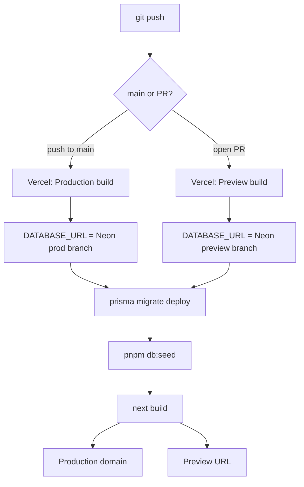

# Deployment

Target: [Vercel](https://vercel.com) (free tier) for the app, [Neon](https://neon.tech) (free
tier) for Postgres. Neither Vercel nor Netlify host a database, so Neon fills that gap. This
doc covers one-time setup and what happens on every deploy after that.



## Why this stack

- **Vercel** has native support for Next.js 16's App Router and Server Actions — no adapter
  layer, unlike Netlify's Next.js Runtime.
- **Neon** is serverless Postgres with a free tier, database branching (used below to isolate
  Preview deploys from production), and a connection pooler that now supports both app queries
  and schema migrations over the same pooled connection string.
- Prisma 7's config (`prisma.config.ts`) only exposes a single `datasource.url` — there's no
  separate direct/unpooled URL slot for migrations the way older Prisma setups needed. One
  pooled `DATABASE_URL` covers both `prisma migrate deploy` and runtime queries.

## One-time setup

### 1. Neon: create the production database

1. Create a Neon project.
2. Copy its **pooled** connection string. This is the value for `DATABASE_URL` in Production.

### 2. Neon: create a Preview branch

1. In the same Neon project, create a second **branch** (Neon's free tier supports branching).
   This gives Preview deployments (from PRs) their own database, so every PR build's
   `prisma migrate deploy && pnpm db:seed` runs against a throwaway copy instead of mutating
   production data.
2. Copy that branch's pooled connection string. This is the value for `DATABASE_URL` in
   Preview.

### 3. Generate an Auth.js secret

```sh
pnpm dlx auth secret
```

Use the same value for `AUTH_SECRET` in both Production and Preview.

### 4. Decide on OAuth: guest-mode-only vs. real sign-in

`src/lib/env.ts` requires `AUTH_GITHUB_ID`, `AUTH_GITHUB_SECRET`, `AUTH_GOOGLE_ID`, and
`AUTH_GOOGLE_SECRET` to be **non-empty** whenever `NODE_ENV=production` — but nothing requires
them to be _real_ credentials if you aren't launching sign-in yet.

- **Guest-mode-only for the first deploy (recommended):** use placeholder values, e.g.
  `unused-in-guest-mode`, for all four. The app boots and the guest flow works; sign-in itself
  is broken until real credentials are added later. This is what the current deploy targets.
- **Real sign-in at launch:** register a GitHub OAuth App and a Google OAuth Client, each with
  callback URL `https://<your-production-domain>/api/auth/callback/<provider>`. You need the
  production domain before you can finish this, so it's usually a follow-up after step 5.

### 5. Import the repo into Vercel

1. New Project → import this repo. Framework preset (Next.js) is auto-detected; no
   `vercel.json` is needed.
2. Set environment variables — note `DATABASE_URL` differs between Production and Preview,
   everything else is the same in both:

   | Variable             | Production                      | Preview                      |
   | -------------------- | ------------------------------- | ---------------------------- |
   | `DATABASE_URL`       | Neon production branch (pooled) | Neon preview branch (pooled) |
   | `AUTH_SECRET`        | real secret from step 3         | same                         |
   | `AUTH_GITHUB_ID`     | placeholder or real, per step 4 | same                         |
   | `AUTH_GITHUB_SECRET` | placeholder or real, per step 4 | same                         |
   | `AUTH_GOOGLE_ID`     | placeholder or real, per step 4 | same                         |
   | `AUTH_GOOGLE_SECRET` | placeholder or real, per step 4 | same                         |

3. Deploy (push to `main`, or trigger manually).

## What happens on every deploy

`package.json` defines:

```json
"postinstall": "prisma generate",
"vercel-build": "prisma migrate deploy && pnpm db:seed && next build"
```

Vercel runs `pnpm install` (triggering `postinstall` → regenerates the Prisma client into
`src/generated/prisma`, which is gitignored so it must be generated on every build), then
detects `vercel-build` and runs it instead of the default `build` script:

1. `prisma migrate deploy` — applies any pending migrations.
2. `pnpm db:seed` — upserts certification/domain/subtopic/question content
   (`prisma/seed/certifications/*.json`) keyed on stable slugs. This is **idempotent by
   design** (see the comment at the top of `prisma/seed.ts`), so re-running it against an
   already-seeded database — including production — does not duplicate rows.
3. `next build` — production build.

Every push to `main` deploys to Production. Every PR gets its own Preview deployment, running
the same three steps against the Preview Neon branch.

## Post-deploy verification

- Visit the deployment URL — the landing page rendering proves DB connectivity and successful
  seeding.
- Start a practice attempt as a guest and confirm questions load — proves `DATABASE_URL` and
  seed data are correct end-to-end.
- Open a throwaway PR and confirm the Preview deployment builds cleanly against the Preview
  Neon branch (not production) and renders seeded content.
- Check Vercel's build/function logs for the first deploy for two failure modes specifically:
  a `env.ts` Zod validation error (missing/empty required env var) or a Prisma connection
  error (wrong `DATABASE_URL`).

## Known follow-ups

- **Real OAuth.** Once launched in guest-mode-only, register real GitHub/Google OAuth
  credentials against the production domain and swap the placeholder env vars.
- **Second deployable service.** `docs/vision.md` describes a future Python agent-service
  (PDF/URL ingestion, coding-exercise feedback) running as a separate background service,
  suggested there as "Vercel/Railway (or similar)." That service does not exist yet and isn't
  covered by this doc — when it's built, this doc should gain a second section for it, since
  it's a second deployable unit with its own env vars and hosting decision, not something that
  fits inside `vercel-build`.
